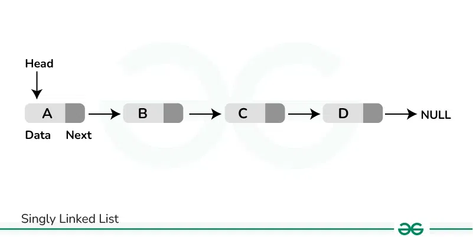

The concept of singly linked list is pretty simple—this image tells what it is quite clearly:



### Notice: 
1. How there are two parts of each 'node', one contains the data, the other points to the 'next' node (thus, here, called a 'pointer' container); this creates an unidirectonal flow, one node pointing to the next.
2. The first element is a 'Head' but that is not a node, just the initial pointer we will keep with ourselves
3. the end of a linked list is imagined with a Null pointer (`None`, you pricky bastard).
4. This is unidirectional, one pointer can't point to two addresses.

Here's a typical Singly Linked Lists code:

```python
class Node:

    def __init__(self, data):
        self.data = data      # store the data
        self.next = None      # pointer to the next node

    def __repr__(self):
        return f"Node({self.data})"

'''
class Node:
    def __init__(self, data, next=None):
        self.data = data
        self.next = next

# and

class Node:
    def __init__(self, data):
        self.data = data
        self.next = None

# They are functionally different.
the former is dynamic, it means, you can directly assign values as:
n1 = Node(1)
n2 = Node(2, next=n1)

the latter always sets next to None, so you have to manually change it each time like:
n1 = Node(1) # so here n1.data is 1, and n1.next is None
n2 = Node(2) # again, here n2.data is 2, and n2.next is None
# To point, you have to make a pointer, of course, so you go:
n2.next = n1 # now, n2 points to n1
'''

'''
About __repr__, it is object representation- note that down- it represents an object for us in developer redable format, by simply giving us a hint of what the object instance stands as in which class. 
You can use it with !r flag, which basically makes it true developer readable
for example:
    without !r:
        output: Node(Victor)
    with !r:
        output: Node('Victor')
So, though it is a string, it is shown that it is a string (and not just an object file or some sneaky, sussy generator expression 👀)
'''
```

```python
class LinkedList:
    def __init__(self):
        self.head = None

    def append(self, data):
        """Add a node at the end."""
        new_node = Node(data)
        if not self.head:
            self.head = new_node
            return
        current = self.head
        while current.next:
            current = current.next
        current.next = new_node

    def prepend(self, data):
        """Add a node at the start."""
        new_node = Node(data)
        new_node.next = self.head
        self.head = new_node

    def find(self, data):
        """Return first node with given data, else None."""
        current = self.head
        while current:
            if current.data == data:
                return current
            current = current.next
        return None

    def delete(self, data):
        """Delete first occurrence of data."""
        if not self.head:
            return
        if self.head.data == data:
            self.head = self.head.next
            return
        current = self.head
        while current.next:
            if current.next.data == data:
                current.next = current.next.next
                return
            current = current.next

    def __repr__(self):
        nodes = []
        current = self.head
        while current:
            nodes.append(repr(current))
            current = current.next
        return " -> ".join(nodes)
```


